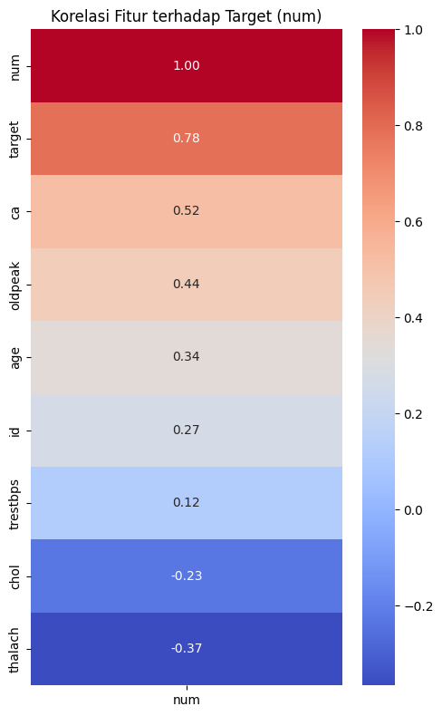

# Laporan Proyek Machine Learning - Laila Rohmatul I'zzah

## Domain Proyek

Penyakit jantung dan pembuluh darah atau yang dikenal sebagai penyakit kardiovaskular, kini menjadi salah satu ancaman utama bagi kesehatan global, khususnya dalam kelompok Penyakit Tidak Menular (PTM). Di Indonesia, gangguan kardiovaskular tercatat sebagai penyebab kematian tertinggi berdasarkan hasil studi kohort PTM selama periode 2011 hingga 2021. Menurut laporan dari World Health Organization (WHO), lebih dari 17 juta orang di seluruh dunia kehilangan nyawa setiap tahunnya akibat penyakit ini. Di Indonesia sendiri, jumlah kematian tahunan akibat penyakit kardiovaskular diperkirakan mencapai 651.481 jiwa, dengan stroke menyumbang 331.349 kasus, penyakit jantung koroner 245.343 kasus, dan jantung akibat hipertensi sebanyak 50.620 kasus.

Laporan Global Status Report on Noncommunicable Diseases (NCD) 2019 yang dirilis oleh IHME menunjukkan bahwa penyakit jantung menyumbang 1 dari 3 kematian di dunia. Banyaknya kasus kematian tersebut membuat penyakit jantung menjadi salah satu perhatian Pemerintah Republik Indonesia untuk melakukan penanganan dan pencegahan terhadap penyakit tidak menular tersebut. Berdasarkan penelitian yang dilakukan oleh Hidayat et al. (2024), banyak faktor yang dapat memprediksi seseorang memiliki penyakit jantung, salah satu faktor utamanya adalah hipertensi. Selain itu, beberapa faktor seperti pola makan tinggi karbohidrat dan lemak, aktivitas fisik rendah, dan merokok juga dapat menjadi faktor tambahan untuk mengetahui seberapa besar risiko terhadap penyakit jantung.

Diagnosis penyakit jantung sendiri umumnya dilakukan melalui serangkaian tes klinis yang memerlukan waktu, biaya, dan tenaga medis yang terbatas. Dengan perkembangan teknologi, machine learning (ML) menjadi pendekatan potensial untuk membantu proses diagnosis dini berbasis data medis pasien. Model klasifikasi berbasis ML dapat dilatih untuk mengenali pola dari data seperti tekanan darah, kolesterol, usia, dan riwayat medis lainnya, guna memprediksi apakah seseorang berisiko terkena penyakit jantung.

Penerapan model prediktif ini penting karena:
- Membantu dokter dalam mengambil keputusan awal sebelum pemeriksaan lanjutan
- Meningkatkan efisiensi proses skrining massal di fasilitas kesehatan
- Menyediakan sistem peringatan dini untuk pasien yang tidak menyadari gejala

Dengan menggunakan dataset Heart Disease UCI yang telah banyak digunakan untuk penelitian prediktif medis, proyek ini bertujuan untuk membangun sistem klasifikasi yang mampu memprediksi risiko penyakit jantung secara akurat.

**Referensi**

World Health Organization. (2021). Cardiovascular diseases (CVDs). https://www.who.int/news-room/fact-sheets/detail/cardiovascular-diseases-(cvds)

Kementerian Kesehatan Republik Indonesia. (2018). Laporan Riskesdas 2018. Badan Penelitian dan Pengembangan Kesehatan.

Hidayat, R., Wahyuni, S., & Susanti, E. (2024). Prediksi penyakit jantung menggunakan algoritma support vector machine (SVM). BIOS: Jurnal Ilmiah Biologi, 5(2), 83–90. https://doi.org/10.37148/bios.v5i2.152

Redwankarimsony. (2023). Heart Disease Data [Data set]. Kaggle. https://www.kaggle.com/datasets/redwankarimsony/heart-disease-data

## Business Understanding

### Problem Statements

- Bagaimana memanfaatkan data rekam medis sederhana untuk memprediksi kemungkinan seseorang mengidap penyakit jantung?
- Apakah model machine learning dapat membantu proses diagnosis penyakit jantung secara otomatis dan efisien?
- Algoritma machine learning mana yang paling optimal dalam memberikan prediksi risiko penyakit jantung pada dataset yang tersedia?

### Goals

- Membangun model prediktif berbasis machine learning yang mampu mendeteksi kemungkinan seseorang mengidap penyakit jantung berdasarkan data klinis.
- Menyediakan sistem prediksi yang cepat, murah, dan akurat untuk mendukung diagnosis awal penyakit jantung.
- Mengevaluasi dan membandingkan beberapa algoritma machine learning untuk mendapatkan model terbaik dengan performa optimal.

### Solution statements ###

- Membangun model baseline menggunakan algoritma KNN karena algoritma ini relatif sederhana dibandingkan dengan algoritma lain, serta bisa digunakan untuk klasifikasi sebagaimana dalam proyek ini.
- Membandingkan performa model baseline dengan algoritma lain seperti Random Forest dan XGBoost, yang dikenal memiliki kemampuan tinggi dalam menangani dataset tabular dan klasifikasi kompleks.
- Melakukan tuning hyperparameter pada model terbaik untuk meningkatkan akurasi, recall, dan precision prediksi.
- Menggunakan metrik evaluasi seperti Accuracy, Precision, Recall, dan F1-Score untuk mengukur performa setiap model secara objektif.

## Data Understanding
Dataset yang digunakan berasal dari [Kaggle - Heart Disease Dataset](https://www.kaggle.com/datasets/redwankarimsony/heart-disease-data). Dataset ini merupakan subset dari Cleveland Heart Disease Database, yang merupakan salah satu referensi paling umum dalam penelitian machine learning untuk prediksi penyakit jantung.

Dataset ini merupakan tipe multivariat (multivariate dataset), artinya terdiri dari banyak variabel numerik dan kategorikal yang digunakan untuk analisis. Tujuan utamanya adalah untuk memprediksi kemungkinan seseorang mengidap penyakit jantung berdasarkan data rekam medis mereka.

### Variabel-variabel pada Heart Disease Dataset adalah sebagai berikut:
#### Jumlah Data
- Jumlah fitur: 14 fitur utama + 1 target
- Jumlah data (rows): Tergantung file final, umumnya sekitar 300+ data
#### Fitur-fitur dalam Dataset
Berikut ini adalah penjelasan dari fitur-fitur yang digunakan:
1. id: ID unik untuk setiap pasien
2. age: Usia pasien (dalam tahun)
3. origin: Lokasi asal data dikumpulkan
4. sex: Jenis kelamin (Male/Female)
5. cp: Jenis nyeri dada (typical angina, atypical angina, non-anginal, asymptomatic)
6. trestbps: Tekanan darah saat istirahat (mm Hg)
7. chol: Kadar kolesterol dalam darah (mg/dl)
8. fbs: Kadar gula darah puasa > 120 mg/dl (1 = ya, 0 = tidak)
9. restecg: Hasil elektrokardiografi saat istirahat (normal, stt abnormality, lv hypertrophy)
10. thalach: Detak jantung maksimum yang dicapai
11. exang: Angina akibat olahraga (1 = ya, 0 = tidak)
12. oldpeak: Depresi ST akibat latihan dibandingkan kondisi istirahat
13. slope: Kemiringan segmen ST saat puncak latihan
14. ca: Jumlah pembuluh darah besar yang terlihat dalam fluoroskopi (0–3)
15. thal: Hasil tes Thalassemia (normal, fixed defect, reversible defect)
16. num: Target (0 = tidak ada penyakit jantung, 1 = ada penyakit jantung)

### Exploratory Data Analysis
#### Informasi Dataset

- Terdapat 8 kolom dengan tipe object, yaitu: sex, dataset, cp, fbs, restecg, exang, slope, dan thal. Kolom ini merupakan categorical features (fitur non-numerik).
- Terdapat 5 kolom numerik dengan tipe data float64 yaitu: trestbps, chol, thalch, oldpeak, dan ca. Ini merupakan fitur numerik yang merupakan hasil pengukuran secara fisik.
- Terdapat 3 kolom numerik dengan tipe data int64, yaitu: id, age, dan num. Kolom 'num' merupakan target fitur.

#### Deteksi Missing Values

Ada perbedaan jumlah data pada kolom *trestbps, chol, fbs, restecg, thalch, exang, oldpeak, slope, ca,* dan *thal*. Hal ini menunjukkan adanya missing values pada kolom tersebut. 

#### Deteksi Data Duplikat

Pada data ini tidak ditemukan data yang duplikat

### Visualisasi Data

- age: Terdistribusi normal dengan puncak sekitar usia 55 tahun. Artinya, mayoritas pasien berusia menengah hingga tua.
- trestbps (tekanan darah saat istirahat): Terdistribusi miring ke kanan (right-skewed), dengan banyak pasien memiliki tekanan darah sekitar 120 mmHg.
- chol (kolesterol): Sangat miring ke kanan, dengan beberapa outlier ekstrem. Ini menunjukkan banyak pasien dengan kadar kolesterol tinggi.
- thalach (denyut jantung maksimum): Terdistribusi agak normal, puncaknya sekitar 140 bpm.
- oldpeak (ST depression): Banyak nilai nol, menunjukkan sebagian besar pasien tidak menunjukkan depresi ST saat uji stres. Tapi ada ekor kanan (right-skewed).

- sex: Mayoritas pasien adalah laki-laki.
- cp (chest pain): Jenis asymptomatic paling dominan.
- fbs (fasting blood sugar): Sebagian besar pasien memiliki kadar gula < 120 mg/dl (False).
- restecg: Mayoritas hasil ECG adalah normal.
- exang (angina yang dipicu olahraga): Lebih banyak pasien tidak mengalami exercise-induced angina.
- slope: Bentuk slope ST flat paling banyak.
- thal: Terdistribusi hampir seimbang antara normal dan reversible defect, lebih sedikit fixed defect

Terdapat sedikit ketidakseimbangan pada distribusi target, di mana kelas "Ada" penyakit jantung lebih banyak dibanding "Tidak Ada". Namun, karena perbedaan proporsinya tidak terlalu signifikan (~55% vs 45%), maka metrik evaluasi seperti akurasi, precision, recall, dan F1-score tetap relevan tanpa perlu menerapkan teknik penyeimbangan kelas.

## Data Preparation
Pada bagian ini Anda menerapkan dan menyebutkan teknik data preparation yang dilakukan. Teknik yang digunakan pada notebook dan laporan harus berurutan.

**Rubrik/Kriteria Tambahan (Opsional)**: 
- Menjelaskan proses data preparation yang dilakukan
- Menjelaskan alasan mengapa diperlukan tahapan data preparation tersebut.

## Modeling

### 1. Pemilihan Algoritma 

Pada proyek ini digunakan 3 algoritma klasifikasi untuk memprediksi risiko penyakit jantung, yaitu:

1. K-Nearest Neighbors (KNN)
2. Random Forest Classifier
3. Extreme Gradient Boosting (XGBoost)

Pemilihan ketiga algoritma tersebut dilakukan untuk membandingkan performa masing-masing model dan menentukan algoritma terbaik dalam menyelesaikan permasalahan klasifikasi risiko penyakit jantung.

### 2. Tahapan Modeling

1. **Split Data**  
    Dataset dibagi menjadi data latih (80%) dan data uji (20%) menggunakan fungsi `train_test_split`.

2. **Pemodelan**
   - Model **KNN** dibangun dengan parameter default `n_neighbors=5`.
   - Model **Random Forest** dibangun dengan `n_estimators=100`.
   - Model **XGBoost** dibangun dengan parameter dasar:
     - `eval_metric='logloss'`
     - `use_label_encoder=False`

3. **Prediksi & Evaluasi**  
   Digunakan `classification_report` untuk menghitung metrik evaluasi: akurasi, precision, recall, dan f1-score.

### 3. Kelebihan dan Kekurangan Algoritma

Berikut ini adalah kelebihan dan kekurangan dari masing-masing algoritma yang digunakan dalam pemodelan:

#### 1. K-Nearest Neighbor (KNN)
- **Kelebihan:**
  - Mudah dipahami dan diimplementasikan.
  - Tidak membuat asumsi tentang distribusi data.

- **Kekurangan:**
  - Sangat sensitif terhadap skala fitur (dapat diatasi dengan standardisasi).
  - Tidak optimal untuk data dengan banyak noise atau outlier.
  - Tidak dapat menangani data kosong (*missing values*).

#### 2. Random Forest
- **Kelebihan:**
  - Cocok untuk data tabular seperti dataset ini.
  - Tidak memerlukan proses scaling atau normalisasi.
  - Tahan terhadap outlier dan *missing value* (hingga batas tertentu).
  - Memberikan insight berupa *feature importance*.

- **Kekurangan:**
  - Komputasi bisa menjadi berat jika jumlah *tree* sangat banyak.

#### 3. XGBoost
- **Kelebihan:**
  - Performa tinggi untuk klasifikasi data tabular.
  - Mampu menangani data imbalance, *missing value*, dan outlier dengan baik.
  - Mendukung banyak opsi *tuning* untuk optimasi akurasi.

- **Kekurangan:**
  - Proses *tuning* lebih kompleks (learning rate, estimators, max depth, dll.).
  - Interpretasi model lebih rumit dibandingkan Random Forest.

### 4. Model Terbaik

  Berdasarkan hasil evaluasi, diperoleh model terbaik adalah **Random Forest** karena memiliki akurasi tertinggi sebesar 89,1%. Selain itu, algoritma ini juga memiliki F1-score tertinggi di kedua kelas (0 dan 1), serta memiliki keseimbangan precision dan recall yang sangat baik. 

## Evaluation
Pada bagian ini anda perlu menyebutkan metrik evaluasi yang digunakan. Lalu anda perlu menjelaskan hasil proyek berdasarkan metrik evaluasi yang digunakan.

Sebagai contoh, Anda memiih kasus klasifikasi dan menggunakan metrik **akurasi, precision, recall, dan F1 score**. Jelaskan mengenai beberapa hal berikut:
- Penjelasan mengenai metrik yang digunakan
- Menjelaskan hasil proyek berdasarkan metrik evaluasi

Ingatlah, metrik evaluasi yang digunakan harus sesuai dengan konteks data, problem statement, dan solusi yang diinginkan.

**Rubrik/Kriteria Tambahan (Opsional)**: 
- Menjelaskan formula metrik dan bagaimana metrik tersebut bekerja.

**---Ini adalah bagian akhir laporan---**

_Catatan:_
- _Anda dapat menambahkan gambar, kode, atau tabel ke dalam laporan jika diperlukan. Temukan caranya pada contoh dokumen markdown di situs editor [Dillinger](https://dillinger.io/), [Github Guides: Mastering markdown](https://guides.github.com/features/mastering-markdown/), atau sumber lain di internet. Semangat!_
- Jika terdapat penjelasan yang harus menyertakan code snippet, tuliskan dengan sewajarnya. Tidak perlu menuliskan keseluruhan kode project, cukup bagian yang ingin dijelaskan saja.
